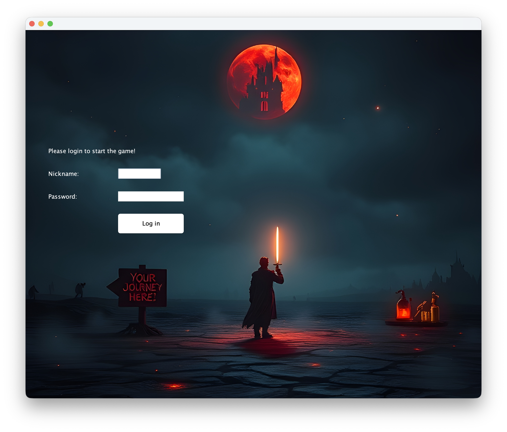
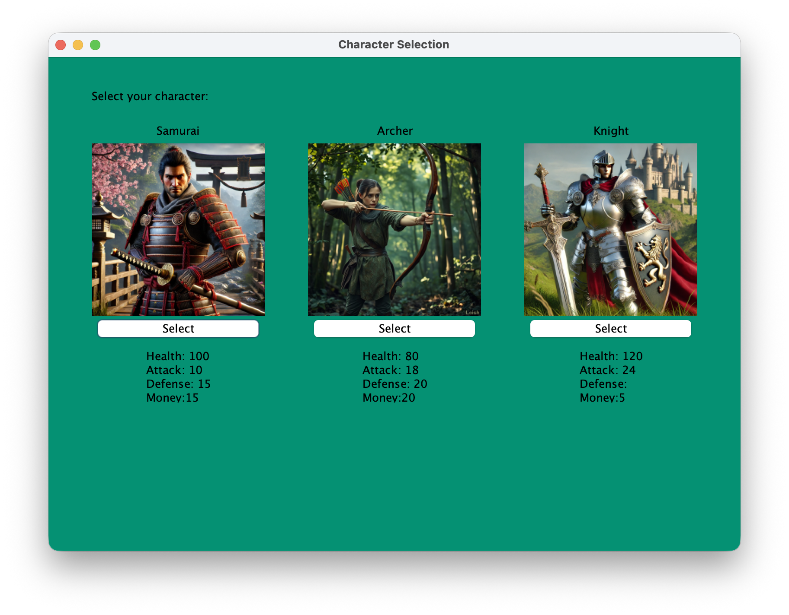
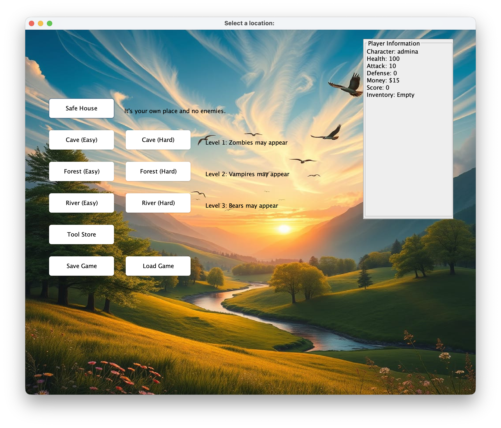
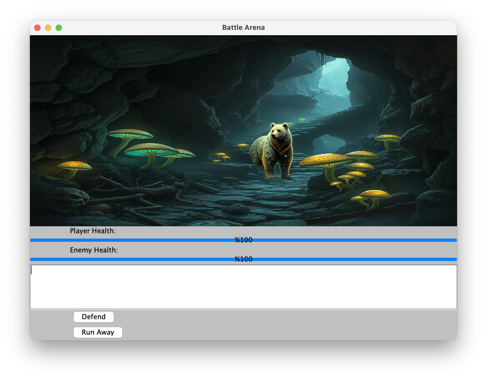

<div align="center">

# Java Adventure Game

**A turn-based RPG built with Java Swing, featuring character classes, real-time combat, inventory management, and a full save/load system.**

Built to demonstrate object-oriented programming principles -- inheritance, polymorphism, abstraction, and encapsulation.

[](https://openjdk.org/)
[](#)
[](#)
[](#)

</div>

---

## Screenshots

<div align="center">

| Login | Character Selection |
|:---:|:---:|
|  |  |

| Location Map | Battle Arena |
|:---:|:---:|
|  |  |

</div>

---

## Table of Contents

- [Features](#features)
- [Game Overview](#game-overview)
- [Architecture](#architecture)
- [Getting Started](#getting-started)
- [Project Structure](#project-structure)
- [Technologies](#technologies)

---

## Features

| Category | Details |
|---|---|
| **Character Classes** | Three playable classes (Samurai, Archer, Knight) with unique stats |
| **Combat System** | Click-to-attack battles with animated sprites, health bars, and battle log |
| **Exploration** | Five distinct locations -- Cave, Forest, River, Safe House, Tool Store |
| **Economy** | Earn coins from combat, spend them on weapons and armor |
| **Progression** | Sequential location unlocks with increasing difficulty |
| **Save / Load** | Full game state persistence via Java serialization |
| **Difficulty Modes** | Easy and Hard modes that scale enemy stats and count |
| **Soundtrack** | Looping background music throughout gameplay |

---

## Game Overview

### Character Classes

| Class | HP | ATK | DEF | Gold | Playstyle |
|:---:|:---:|:---:|:---:|:---:|---|
| **Samurai** | 100 | 10 | 15 | 15 | Balanced -- solid all-around stats |
| **Archer** | 80 | 18 | 20 | 20 | Glass cannon -- high attack, lower health |
| **Knight** | 120 | 24 | 5 | 5 | Tank -- highest HP and attack, low defense bonus |

> All characters begin with a base of **200 gold** plus their class bonus.

### Locations

```
Safe House ──── Heal to full HP
    │
Cave ──────── Level 1 · Bears · Reward: Food
    │
Forest ────── Level 2 · Vampires · Reward: Firewood
    │
River ─────── Level 3 · Zombies · Reward: Water
    │
Tool Store ── Buy weapons & armor
```

### Enemies

| Enemy | DMG | HP | Bounty | Max Spawns |
|:---:|:---:|:---:|:---:|:---:|
| Bear | 7 | 25 | 12g | 3 |
| Vampire | 4 | 14 | 7g | 3 |
| Zombie | 3 | 20 | 4g | 3 |

Each kill also grants **+10 score** and **+5 gold**.

### Equipment

<details>
<summary><b>Weapons</b></summary>

| Weapon | Cost | Bonus DMG |
|---|---|---|
| Pistol | 16g | +10 |
| Sword | 35g | +15 |
| Rifle | 55g | +20 |

</details>

<details>
<summary><b>Armor</b></summary>

| Armor | Cost | Bonus DEF |
|---|---|---|
| Light Armor | 15g | +1 |
| Medium Armor | 25g | +3 |
| Heavy Armor | 40g | +5 |

</details>

### Difficulty Scaling

| Mode | Enemy DMG | Enemy HP | Spawn Count |
|:---:|:---:|:---:|:---:|
| Easy | Base | Base | Base |
| Hard | +5 | +20% | Up to 2x |

---

## Architecture

### Class Hierarchy

```
                        ┌──────────────────┐
                        │       Main       │
                        └────────┬─────────┘
                                 │
                        ┌────────▼─────────┐
                        │       Game       │  ← Central Controller
                        └──┬───┬───┬───┬───┘
                           │   │   │   │
            ┌──────────────┘   │   │   └──────────────┐
            │                  │   │                   │
   ┌────────▼────────┐        │   │         ┌─────────▼─────────┐
   │     Player      │        │   │         │    MusicPlayer    │
   │  └─ Inventory   │        │   │         └───────────────────┘
   └─────────────────┘        │   │
                               │   │
              ┌────────────────┘   └────────────────┐
              │                                     │
   ┌──────────▼──────────┐               ┌──────────▼──────────┐
   │  Location (abstract)│               │  Obstacles (abstract)│
   ├─────────────────────┤               ├──────────────────────┤
   │ BattleLoc (abstract)│               │  Bear                │
   │  ├─ Cave            │               │  Vampire             │
   │  ├─ Forest          │               │  Zombie              │
   │  └─ River           │               └──────────────────────┘
   │ NormalLoc (abstract)│
   │  └─ SafeHouse       │
   └─────────────────────┘

   Supporting: GameState (Serializable) · GameDifficulty (Enum) · BattleResultListener (Interface)
```

### Design Patterns

| Pattern | Where |
|---|---|
| **Template Method** | `Location.getLoc()` -- subclasses define specific behavior |
| **Inheritance** | `Location` → `BattleLoc` / `NormalLoc`; `Obstacles` → `Bear` / `Vampire` / `Zombie` |
| **Abstraction** | Abstract classes enforce contracts across locations and enemies |
| **Strategy** | `GameDifficulty` enum toggles stat scaling at runtime |
| **MVC-like** | `Game` (controller) · `Player` / `Inventory` (model) · Swing panels (view) |
| **Serialization** | `GameState` persists full game state to disk |

---

## Getting Started

### Prerequisites

- **JDK 9+** (uses the Java Module System)

### Build & Run

```bash
# Clone
git clone https://github.com/<your-username>/JavaAdventureGame.git
cd JavaAdventureGame

# Compile
javac -d bin src/module-info.java src/oyun21/*.java

# Run
java --module-path bin -m oyun21/oyun21.Main
```

> **Note:** The `src/image/` and `src/sound/` directories must be on the classpath for assets to load correctly.

---

## Project Structure

```
JavaAdventureGame/
│
├── src/
│   ├── module-info.java                # Module descriptor (requires java.desktop)
│   │
│   ├── oyun21/                         # Source package
│   │   ├── Main.java                   # Entry point
│   │   ├── Game.java                   # Game controller & UI orchestration
│   │   ├── Player.java                 # Player stats, health, score
│   │   ├── Inventory.java              # Weapons, armor, collectibles
│   │   │
│   │   ├── Location.java              # ─ abstract ─ base location
│   │   ├── BattleLoc.java            # ─ abstract ─ combat location
│   │   ├── NormalLoc.java            # ─ abstract ─ safe location
│   │   ├── Cave.java                  #   Level 1 (Bear)
│   │   ├── Forest.java               #   Level 2 (Vampire)
│   │   ├── River.java                #   Level 3 (Zombie)
│   │   ├── SafeHouse.java            #   Health restore
│   │   ├── ToolStore.java            #   Shop UI
│   │   │
│   │   ├── Obstacles.java            # ─ abstract ─ enemy base
│   │   ├── Bear.java                  #   Enemy type
│   │   ├── Vampire.java              #   Enemy type
│   │   ├── Zombie.java               #   Enemy type
│   │   │
│   │   ├── BattleScreen.java         # Combat UI & animations
│   │   ├── BattleResultListener.java # Callback interface
│   │   ├── MusicPlayer.java          # WAV playback
│   │   ├── GameState.java            # Serializable save state
│   │   └── GameDifficulty.java       # EASY / HARD enum
│   │
│   ├── image/                          # Sprites & backgrounds (11 assets)
│   └── sound/                          # Background music (WAV)
│
├── bin/                                # Compiled .class output
├── doc/                                # JavaDoc HTML
└── screenshots/                        # Game screenshots
```

---

## Technologies

| Technology | Purpose |
|---|---|
| **Java 9+** | Core language with module system |
| **Java Swing / AWT** | GUI -- windows, panels, buttons, dialogs |
| **Java Serialization** | Save & load via `ObjectOutputStream` / `ObjectInputStream` |
| **Java Sound API** | Background music loop (WAV) |

---

<div align="center">

*Developed in March 2025 as an academic project to demonstrate OOP principles in Java.*

</div>
